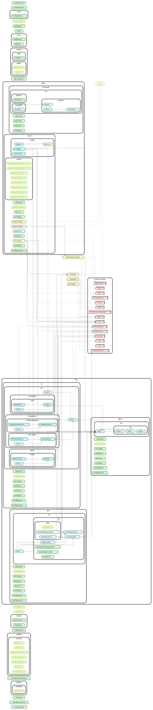

# Molecular Stackbit Theme

> A Stackbit starter theme for the enterprise

## Background

While JAMStack has become a darling of the OSS and Silicon
Valley scenes for some time now, it has failed to gain
significant traction in the enterprise. The goal of this project
is to provide a reference implementation for a JAMStack starter
theme suitable for enterprise use-cases.

## Features

### 0.1.0 (v0alpha1)

1. [x] Multi-project monorepo setup
2. [x] Strict typescript setup with static analysis and linting support
3. [x] Fully configured cypress setup for E2E testing
4. [x] Fully configured jest environment with code coverage
5. [x] Automated refactoring and code generation tools
6. [x] 0 config remote build cache (keeps CI/CD costs to a minimum)

### 0.2.0 (v0alpha2)

1. [x] Stackbit V2 starter content w/ daisyui theme
2. [x] Highly optimized build output with a page bundle size under 50KB
3. [x] Advanced GitHub workflow setup to enhance pull requests with build statistics, test results, and a unique preview URL
4. [x] Full static analysis support (see bellow).

### Pull Reqiest

### Nx Cloud

## Workspace Contents

## Module Graph

### Dependency Graph

**note:** The leaf nodes on this graph are navigable if supported by your viewer.

## Local Development

## Quickstart

See the `Makefile` for supported build commands, or just run `make ci` to build and test all bundles for production.

## Adding capabilities to your workspace

Nx supports many plugins which add capabilities for developing different types of applications and different tools.

These capabilities include generating applications, libraries, etc as well as the devtools to test, and build projects as well.

Below are the core plugins:

- [React](https://reactjs.org)
  - `npm install --save-dev @nrwl/react`
- Web (no framework frontends)
  - `npm install --save-dev @nrwl/web`
- [Angular](https://angular.io)
  - `npm install --save-dev @nrwl/angular`
- [Nest](https://nestjs.com)
  - `npm install --save-dev @nrwl/nest`
- [Express](https://expressjs.com)
  - `npm install --save-dev @nrwl/express`
- [Node](https://nodejs.org)
  - `npm install --save-dev @nrwl/node`

There are also many [community plugins](https://nx.dev/community) you could add.

## Generate an application

Run `nx g @nrwl/react:app my-app` to generate an application.

> You can use any of the plugins above to generate applications as well.

When using Nx, you can create multiple applications and libraries in the same workspace.

## Generate a library

Run `nx g @nrwl/react:lib my-lib` to generate a library.

> You can also use any of the plugins above to generate libraries as well.

Libraries are shareable across libraries and applications. They can be imported from `@waweb/mylib`.

## Development server

Run `nx serve my-app` for a dev server. Navigate to http://localhost:4200/. The app will automatically reload if you change any of the source files.

## Code scaffolding

Run `nx g @nrwl/react:component my-component --project=my-app` to generate a new component.

## Build

Run `nx build my-app` to build the project. The build artifacts will be stored in the `dist/` directory. Use the `--prod` flag for a production build.

## Running unit tests

Run `nx test my-app` to execute the unit tests via [Jest](https://jestjs.io).

Run `nx affected:test` to execute the unit tests affected by a change.

## Running end-to-end tests

Run `nx e2e my-app` to execute the end-to-end tests via [Cypress](https://www.cypress.io).

Run `nx affected:e2e` to execute the end-to-end tests affected by a change.

## Understand your workspace

Run `nx graph` to see a diagram of the dependencies of your projects.

## Further help

Visit the [Nx Documentation](https://nx.dev) to learn more.

## ☁ Nx Cloud

### Distributed Computation Caching & Distributed Task Execution

Nx Cloud pairs with Nx in order to enable you to build and test code more rapidly, by up to 10 times. Even teams that are new to Nx can connect to Nx Cloud and start saving time instantly.

Teams using Nx gain the advantage of building full-stack applications with their preferred framework alongside Nx’s advanced code generation and project dependency graph, plus a unified experience for both frontend and backend developers.

Visit [Nx Cloud](https://nx.app/) to learn more.
